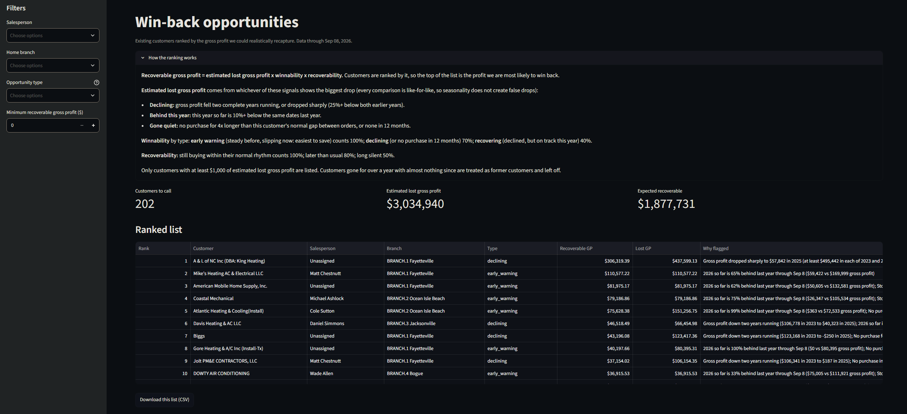
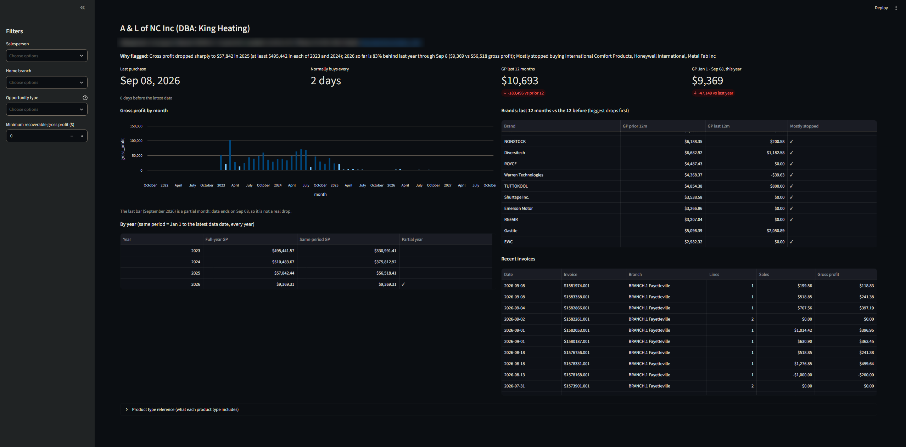

# ADH Case Study: HVAC Distributor Analytics

Turns raw ERP extracts from an HVAC distributor into an analytics foundation, identifies customers with lost sales worth recapturing, and gives salespeople a simple app to act on it.

> **Status:** Part 1 complete: ingest, staging, intermediate and marts are built and tested (190+ dbt tests). Part 2 (opportunity model) built. Part 3 (app) and Part 4 (win-back call sheet) built. Sections for Parts 2-4 describe the planned approach.

---

## Architecture

```
data/raw/*.txt            supplied ERP extracts (not committed)
   │  ingest/ingest.py    fix encoding, load everything as text
   ▼
raw schema                faithful copy of the source + lineage columns
   │  dbt staging         one model per source: rename, type, trim, blank -> NULL
   ▼
staging schema
   │  dbt intermediate    business rules: line types, consignment, header reconciliation, mappings
   ▼
intermediate schema
   │  dbt marts           the three business-ready tables
   ▼
marts schema  ──►  opportunity analysis  ──►  Streamlit app
```

**Stack:** Python, DuckDB (local file database), dbt-duckdb, Streamlit.

### Design decisions

- **Each layer has one job.** Ingest only makes the files loadable, staging only cleans one source at a time, intermediate holds the business rules, and marts present results. When a number looks wrong, the layer tells you where to look: a bad date is a staging problem; a consignment line counted as a sale is an intermediate problem.
- **Business rules are written once.** Rules such as "what counts as a sale" live in intermediate and are reused by every mart and by the app.
- **Raw is a faithful copy.** Everything loads as text; types are cast in staging. Ingest adds `_source_file` and `_source_line` to every row, and they are carried through to the marts, so any row (including header-only rows, which point to their invoice header) can be traced back to the original file line.
- **Staging is materialized as tables, not views.**
  - *Fail early, in the right layer:* every cast runs at build time, so a bad value in any column stops the build at staging instead of surfacing later in whichever model first reads that column.
  - *Faster downstream:* intermediate reads the sales lines several times; with a table the trimming, text repair and casting on 1M+ rows happens once, not on every read.
  - *Faster filtering:* DuckDB keeps min/max statistics on stored typed columns, so date-window filters (e.g. last 12 months) skip whole blocks of rows.
  - *Cost:* some disk space and a few seconds of build time. Tables never go stale because every data load is followed by `dbt build`.
- **Money decides, text labels.** Whether a line carries money is decided by price and COGS, never by free text. Free text (the customer PO field) is only used to name the line type, so a typo can mislabel a line but can never change a dollar.
- **Judgement calls live in reviewable files.** Mappings that are opinions rather than facts (which salesperson IDs are system accounts, which buy-line codes are duplicates and how confident we are) are small CSV seed files in `dbt/seeds/`. The business can review or change them without touching SQL.
- **Strict parsing.** Dates and numbers are cast strictly, so a format change in a future extract fails the build instead of silently becoming NULL.
- **Built for more operating companies.** Every model carries a `company_id`. A new company gets its own staging models that map into the same columns; intermediate, marts and the app do not change.

## Data model

| Layer | Models | Grain |
|---|---|---|
| Staging | `stg_sales` | Invoice line (1.06M) |
| | `stg_orders` | Invoice header (137.5K) |
| | `stg_customers` | Customer account (4,170) |
| | `stg_products` | SKU x branch (1.11M = 159K SKUs x 7 branches) |
| | `stg_inventory` | Product x branch x bin location (snapshot 09/08/2026) |
| | `stg_purchases` | Purchase order line |
| | `stg_branches`, `stg_buylines`, `stg_gltypes`, `stg_salespeople` | Lookups |
| Intermediate | `int_sales_lines` | Invoice line with business rules: line type, is_financial, is_purchase, gross profit |
| | `int_invoices` | Invoice header with line totals and reconciliation status (matched / variance / header_only) |
| | `int_header_only_entries` | One non-product row per header-only invoice, split into charges and adjustments |
| | `int_products` | SKU (159K), with product type, brand (raw and mapped) and non-product flag |
| | `int_inventory_by_branch` | Product x branch: warehouse, consignment and other stock |
| | `int_salespeople` | Salesperson ID mapped to a person, system accounts flagged |
| | `int_customer_transactions` | Everything that counts towards a customer's sales and gross profit: product lines, invoice corrections (header minus lines) and rebates |
| | `int_customer_groups` | Every account mapped to its customer (related bill-to accounts are one customer), from a reviewable seed |
| | `int_customer_product_changes` | Customer x product: gross profit, units and last price, prior 12 vs last 12 months; products they mostly stopped buying |
| | `int_customer_brand_changes` | Roll-up of the product model to brand level; brands they mostly stopped buying (down 80%+) |
| | `int_buylines` | Buy-line code with high-confidence near-duplicates mapped |
| | `int_reporting_dates` | One row: latest date in the data and the rolling 12-month window boundaries |
| Marts | `mart_sales_detail` | Invoice line (1.06M) plus one non-product row per header-only invoice (3,261); names, categories, line type, revenue / cost / gross profit / margin, charges and adjustments, reconciliation flag |
| | `mart_customers` | Customer (3,349, incl. never purchased; related bill-to accounts rolled up): recency, last 12 months vs prior 12, lifetime sales and gross profit (incl. invoice corrections and rebates), buying rhythm, average order value, categories bought, charges and adjustments |
| | `mart_customer_years` | Customer x calendar year (zeros included): full-year sales and gross profit for the trend across complete years, plus same-period (Jan 1 to the as-of day) for judging the unfinished year fairly |
| | `mart_opportunities` | Part 2: customer, scored and ranked by expected recoverable gross profit, with signals and a plain-English reason |
| | `mart_call_sheet` | Part 4: customer x product they mostly stopped buying, with last price, current price and available stock by branch |
| | `mart_products` | SKU (159K): type, brand, sell group, observed price and cost, last-12-month and lifetime sales, stock on hand, active and currently-stocked flags |
| | `mart_inventory_by_branch` | Product x branch: warehouse, available, consignment stock and bin locations |

## Important assumptions

- **Customer = bill-to, with related bill-to accounts rolled up into one customer** (confirmed by ADH). One business can have several bill-to accounts (tax / non-tax, install / service, duplicates); 21 such groups were found by matching names and the customer master's own links, and are kept in a reviewable seed (`customer_groups.csv`). Ship-to and the original bill-to account are kept on sales detail.
- **Gross profit = price - `Ext_COGS`** (confirmed by ADH). COGS matches vendor purchase cost (median ratio 1.00 against PO costs); `Ext_Cost` runs ~6% higher and looks like a standard/commission cost. Both are kept.
- **Consignment is classified by money, not text.** Lines with $0 price and $0 cost are stock movements, kept in the data but excluded from units, frequency and last-purchase metrics. The free-text PO field is only used to label line types.
- **Line types.** Financial lines: sale, consignment billing, return/credit, no-charge. Non-financial ($0/$0): consignment transfer, stock transfer, payment record, other.
- **Returns and credits** (negative price) are netted against sales and flagged.
- **Header-only invoices are never product revenue.** Rebates and loyalty payouts are **factored into gross profit** (confirmed by ADH), treated as a reduction of net sales; they post once a year (Dec 30-31), so year-over-year comparisons stay fair. Service charges, surcharges and fees go in `charge_amount`; other adjustments (AR adjustments, bad debt, prebuys, payment corrections) in `adjustment_amount`. Prebuys are customer deposits: the goods are invoiced later as normal sales, so counting the prebuy would double count.
- **The invoice total is the source of truth** (confirmed by ADH). On 1,527 invoices the lines add up to more than the header (+$794K of price, but cost matches, which points to a missing discount line). Each gets one correction row (header minus lines), so every invoice and every customer total matches the headers; the product lines are kept for detail. Differences of 1 cent (rounding) count as matching.
- **Available stock = warehouse stock minus quantity already committed to orders.** Consignment stock sitting at customer sites and the small undocumented stock types (F/R/T/L/Z, under 0.2% of units) are shown separately and not counted as available.
- **Salespeople:** IDs with the same name (ignoring case) are one person, represented by the most-used ID; house/web/admin IDs are flagged as system accounts.
- **Buy-line near-duplicates:** only high-confidence pairs (identical lookup descriptions) are merged; the raw code is always kept.
- **Identical duplicate lines are legitimate** (verified against invoice header totals) and are kept.
- **Transaction date = ship date.** "Recent" windows roll back from the latest date in the data (2026-09-08), never hardcoded, and are defined once in `int_reporting_dates`.
- **The bill-to on the invoice is the customer for transactions** (rolled up to its customer group); names and attributes come from the customer master. Salesperson = the master's assigned salesperson. ADH confirmed that not every customer gets a rep by design (smaller accounts) and that HOUSE accounts are valued customers handled by the executive team; the app labels them "No dedicated rep" and "House account (executive team)".
- **Active product = sold in the last 12 months**; "currently stocked" (warehouse stock on hand) is a separate flag. The product master has no price or cost, so the product mart shows observed price and COGS from the last 12 months of sales.
- **Blank `Inactive` flag = active customer** (gives 727 inactive).
- **Non-products:** 157 SKUs whose product type is not EQ/PA/IS/OT (accounting entries and one test SKU) are flagged, not deleted.

## Data-quality issues

Full running log with numbers: [docs/DATA_QUALITY.md](docs/DATA_QUALITY.md). Highlights:

1. **Mixed encoding**, even within one file (latin-1 and UTF-8). Decoded line by line: UTF-8 first, latin-1 fallback.
2. **Text garbled by the ERP itself** (e.g. `Rosè` for `Rosè`). Repaired in staging.
3. **Quote characters used for inches** in 244K lines. Loaded with quoting disabled.
4. **No line number on sales lines**, and identical duplicates are real. File + line position is used as the key.
5. **Product master repeated per branch**, and 157 "products" are accounting entries (tax adjustments, fees, gift cards, warranties).
6. **Consignment has no structured flag**, only free-text PO with many typos.
7. **Invoice lines vs headers:** 3,261 header-only invoices and 1,527 invoices where lines exceed the header by $794K of price with matching cost (likely a missing discount line; the header is the source of truth, so a correction row fixes each). Header-only invoices turned out to be not just surcharges but also prebuys (+$787K), rebates (-$735K), AR adjustments and bad debt.
8. **Lookups are incomplete:** one salesperson ID and 8 buy lines are missing from their lookups (reported as dbt warnings).
9. **Two cost columns** with different meanings (see assumptions).
10. **Customer payments are recorded as $0 sales lines** on an "ONLINE PAYMENT" SKU (3,871 lines). Classified as payment records, not sales.
11. **Inventory rows are stock buckets:** our warehouse (per bin) vs consignment stock at customer sites (coded C + customer ID). Summing them all would overstate what can be shipped.
12. **A third of purchasing customers have no dedicated rep** (no salesperson or a house account, 34% of lifetime sales). ADH confirmed this is by design, not a data gap.

## Opportunity methodology (Part 2)

**Question:** which existing customers represent the largest opportunities to recapture lost sales?

**Opportunity = estimated gross profit a customer used to give us and no longer does.** Because the question is about what we can *recapture*, customers are ranked by **expected recoverable gross profit**:

> priority score = estimated lost gross profit x winnability x recoverability

1. **Real sales only:** product lines with money (no consignment transfers, payments or header-only charges and adjustments).
2. **Three signals, all like-for-like** (a partial year is never compared with a full one):
   - **Declining:** gross profit fell two complete years running (one down year can be a blip; two is a trend), **or** dropped sharply: the latest complete year at least 25% below **both** earlier years, with the loss measured from the lower of them so a one-off spike year never inflates it.
   - **Behind this year:** 2026 gross profit from Jan 1 to the as-of day is 10%+ (and $1K+) below the same dates in 2025. Seasonality cancels out because both periods cover the same months. In past years, customers 10-15% behind by September ended the year down 83% of the time, so acting early is justified.
   - **Gone quiet:** no purchase for more than 4x the customer's own normal gap between purchases (5+ invoices), or none in 12 months. In history, gaps over 4x happen in only 1.8% of normal buying, so most customers past 4x are genuinely slipping.
3. **Estimated lost gross profit** = the largest of the three signal estimates (not the sum; they often describe the same drop). Flagged when $1,000 or more.
4. **Winnability** by opportunity type: *early warning* (steady before, slipping now) 1.0, the easiest to save; *declining* and still slipping, or lapsed (no purchase in 12 months) 0.7, likely already moved business elsewhere; *recovering* (declined, on track this year) 0.4. Customers with nothing in 12 months and under $1K in both recent complete years are labelled *former customer* and not ranked, because the question is about existing customers.
5. **Recoverability** by recency relative to the customer's own rhythm: within 2x their normal gap 1.0, 2-4x 0.8, beyond or lapsed 0.5.
6. **Reason:** each flagged customer gets a plain-English explanation, including brands they mostly stopped buying (worth $1K+ a year ago and down 80% or more, so a token order cannot hide the drop), e.g. *"2026 so far is 62% behind last year through Sep 8 ($50,605 vs $132,581 gross profit); Mostly stopped buying AIREFORCE, Warren Technologies, Weitron"*.

**Result:** 198 customers flagged, about $3.06M estimated lost gross profit and $1.87M expected recoverable (117 early warnings, 46 declining, 35 recovering). The largest is A & L of NC: steady at about $500K gross profit a year, then $58K in 2025. Output: `mart_opportunities`. Full reasoning and measurements: [docs/OPPORTUNITY_SPEC.md](docs/OPPORTUNITY_SPEC.md). Thresholds and weights are dbt variables, so they can be changed in one place.

**Weaknesses:** a drop may mean fewer projects rather than a lost customer (no quote, pipeline or competitor data); one large past project can look like a decline; winnability weights are a judgement because there is no outreach-outcome data.

## The application (Part 3)

A Streamlit app (`app/app.py`) for salespeople and managers. It does no calculation of its own: every number comes from a dbt model (the marts, plus `int_customer_brand_changes` for the brands table), so each business rule is written once.

- **Ranked list** of flagged customers with filters (salesperson, branch, opportunity type, minimum recoverable gross profit), headline totals, and a CSV download of the filtered list.
- **Why flagged:** a plain-English reason on every row, plus a "How the ranking works" section explaining the score.
- **Customer detail:** contact details and rep, last purchase vs their normal rhythm, last 12 months vs prior 12, this year vs the same dates last year, gross profit by month, by year, brands with the biggest drops, and recent invoices.
- **Product type reference:** what each product type includes, with its top brands.

| Ranked list | Customer detail |
|---|---|
|  |  |

## Part 4: win-back call sheet

**What:** Part 2 tells a rep *who* to call; the call sheet tells them *what to talk about*. For each customer, the specific products they have mostly stopped buying, with what they used to buy and pay, our current price, and where we have it in stock.

**Why it is valuable:** a product gap is the most direct sign that business has gone to a competitor, and it turns a score into a concrete conversation: *"I saw you stopped buying the T10 Pro thermostats. You were buying about 7 or 8 a month; we have 3 available in Bogue. Want me to set some aside?"* Reps can act on it immediately, and it shows managers exactly what is being lost, not just how much.

**How the data addresses it:**
- `int_customer_product_changes`: customer x product, gross profit, units and last price in the prior 12 vs last 12 months. The window logic now lives here once; the brand drops used in Part 2 are a roll-up of it.
- A product is on the sheet if it was worth $250+ gross profit to the customer a year ago and is down 80%+ (the same rule as brands; about 14 products per flagged customer).
- `mart_call_sheet` adds our current typical price (all customers, last 12 months) and *available* stock (warehouse minus committed) at the customer's home branch, across all branches, and the branch with the most.

**How a salesperson uses it:** in the app's customer detail, the brands table is clickable. Selecting a brand shows its products on the call sheet; with no brand selected, the sheet shows the customer's top products across all brands. Each sheet downloads as a CSV to take into the call.

**What it revealed:** some of the biggest lost products (e.g. A & L's older ICP heat pumps) have no current price and no stock: nobody has bought them in a year. They have likely been replaced by newer models (the R-454B N5H5 series is now the top seller), so "they stopped buying X" sometimes means "X was superseded".

**What I would build next:**
- Suggest the replacement product when a lost product has been superseded (map old to new models), and "customers like you also buy" cross-sell items.
- Log call outcomes (contacted, won back, lost to competitor) so the scoring can learn which opportunities actually convert.
- Alert the rep when a regular customer misses their usual reorder window, before the gap shows up in monthly numbers.

## How to run

```bash
python3 -m venv .venv && source .venv/bin/activate
pip install -r requirements.txt

# 1. Put the supplied ERP .txt files anywhere under data/raw/
# 2. Load them into DuckDB (data/adh.duckdb)
python ingest/ingest.py

# 3. Build and test the dbt models
cd dbt && dbt build && cd ..

# 4. Start the app (opens at http://localhost:8501)
streamlit run app/app.py
```

## Next steps with more time

- Confirm remaining questions with ADH (the five data questions sent were answered and applied): whether a structured consignment flag exists in the ERP, how prebuy deposits are applied, the meaning of the small inventory stock types (F/R/T/L/Z), the two undecided buy-line pairs, and whether Biggs is a contractor or a related stocking location. Also review the 21 related-account groups with the business.
- Seasonally adjusted projection of each customer's current year: use the share of annual buying they usually complete by the as-of date to project the full year, so heating-season buyers are not under-rated in September.
- Derived product categories from descriptions/keywords (the source category fields are nearly empty).
- Salesperson and buy-line mapping tables reviewed with the business.
- Incremental loads instead of full reloads, and scheduled runs.
